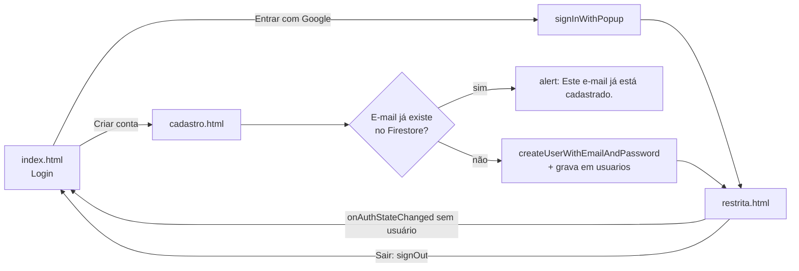

# Projplan – CampusAuth

Planejamento principal do projeto. Atualizado em 2026-09-29.
Fonte dos requisitos: [Regras-Do-Projeto.docx](Regras-Do-Projeto.docx).

## Visão geral

O CampusAuth é a área restrita de um sistema acadêmico. Só entra quem fizer login com Google ou criar conta com e-mail e senha; os dados ficam no Firestore. A atividade vale 1,50 ponto, mais 0,5 de bônus.

**Stack:** HTML, CSS e JavaScript puro com ES modules, usando o Firebase JS SDK modular (v10+) carregado pelo CDN do gstatic. Não tem build nem framework, o que deixa o código fácil de explicar na apresentação.

**Ordem de trabalho:** as áreas estão na ordem de prioridade abaixo. O Firestore (Área 3) vem antes do bônus (Área 4) porque o bônus grava no banco. O HTML começa na Área 1 como uma página de teste servida localmente, ganha o botão do Google na Área 2 e só vira a interface final na Área 5.

| Área | Requisito | Nota |
| --- | --- | --- |
| 1 – Integração com o Firebase | base de tudo | — |
| 2 – Login com Google | Req 1 | 0,20 |
| 3 – Banco Firestore | base do Req 3 e do bônus | — |
| 4 – Bônus: registro de acesso | Bônus | +0,50 |
| 5 – HTML e interface | Organização | 0,20 |
| 6 – Cadastro e e-mail duplicado | Req 2 e 3 | 0,20 + 0,25 |
| 7 – Página protegida, dados e logout | Req 4, 5 e 6 | 0,25 + 0,20 + 0,20 |
| 8 – Segurança e configuração | apoio | — |
| 9 – Testes e entrega | Organização | — |

### Fluxo do usuário



## Área 1 – Integração com o Firebase

Tudo depende desta área. Ela termina quando uma página de teste importa o Firebase e o console do navegador mostra o app inicializado, sem erros.

- [x] Criar o projeto no [Firebase Console](https://console.firebase.google.com) (ou usar o da aula): reaproveitado o `cadastro-6866c`, com os dados antigos apagados
- [x] Registrar um app Web e copiar o objeto `firebaseConfig`
- [x] Em Authentication, ativar os provedores **Google** e **E-mail/senha**
- [x] Criar o banco Firestore (modo de teste no início; as regras de verdade ficam na Área 8)
- [x] Criar `js/firebase-config.js`: `initializeApp`, e exportar `auth` (`getAuth`) e `db` (`getFirestore`). SDK 12.19.0 pelo CDN do gstatic, sem Analytics
- [x] Todas as outras páginas importam `auth` e `db` desse arquivo, nunca inicializam o app de novo
- [x] Subir um servidor local via npm (precisa do [Node.js](https://nodejs.org) instalado). Abrir o HTML direto pelo arquivo (`file://`) não funciona com ES modules nem com o popup do Google
    - Na raiz do projeto: `npm init -y` e `npm install --save-dev live-server`
    - No `package.json`, adicionar o script:

```json
"scripts": {
  "dev": "live-server Codigo --host=localhost --port=5500 --open=index.html"
}
```

    - Rodar com `npm run dev`: abre o navegador em `http://localhost:5500` e recarrega a página sozinho a cada arquivo salvo
    - Para parar o servidor: **Ctrl + C** no terminal onde ele está rodando. Se o Windows perguntar "Deseja finalizar o arquivo em lotes (S/N)?", responder `S`
    - Usar `localhost`, não `127.0.0.1`: só `localhost` vem liberado por padrão nos domínios autorizados do Firebase Auth
    - Criar um `.gitignore` com `node_modules/`
- [x] Criar um `Codigo/index.html` provisório, só para testar a conexão:

```html
<!DOCTYPE html>
<html lang="pt-BR">
<head><meta charset="UTF-8"><title>Teste Firebase</title></head>
<body>
  <h1>Teste de conexão</h1>
  <script type="module">
    import { auth, db } from "./js/firebase-config.js";
    console.log("Firebase OK:", auth.app.name, db.type);
  </script>
</body>
</html>
```

- [x] Rodar `npm run dev`, apertar F12 e confirmar `Firebase OK: [DEFAULT] firestore | projeto: cadastro-6866c` no console, sem erros em vermelho (a página também mostra a mensagem na tela)
- [x] Esse `index.html` vira a tela de login nas Áreas 2 e 5 (já é o login, ainda sem o visual)

A `apiKey` do Firebase Web não é segredo e pode ir para o repositório. Quem protege os dados são as regras do Firestore e os domínios autorizados.

## Área 2 – Autenticação com Google (Req 1 · 0,20)

O botão "Entrar com Google" abre o popup do Google e, com o login feito, leva para `restrita.html`.

- [x] Botão com o texto exato **Entrar com Google** em `index.html`
- [x] `new GoogleAuthProvider()` + `signInWithPopup(auth, provider)`, com `prompt: "select_account"` para poder trocar de conta
- [x] Depois do login, salvar o usuário em `usuarios` se ainda não existir (Área 3) e registrar o acesso (Área 4)
- [x] Redirecionar para `restrita.html`
- [x] Tratar erros: popup fechado (`auth/popup-closed-by-user`), popup bloqueado, domínio não autorizado. Mensagens em `js/erros.js`
- [x] Testar no navegador: login com Google leva à área restrita e grava em `usuarios` e `acessos`

## Área 3 – Banco Firestore

Duas coleções: `usuarios` guarda um documento por pessoa e `acessos` guarda um documento por login.

**`usuarios/{uid}`**

| Campo | Tipo | Origem |
| --- | --- | --- |
| `nome` | string | formulário de cadastro ou `displayName` do Google |
| `email` | string (minúsculo) | formulário ou Google |
| `provedor` | string | `"google"` ou `"senha"` |
| `criadoEm` | timestamp | `serverTimestamp()` |
| `ultimoAcesso` | timestamp | atualizado a cada login (bônus) |

**`acessos/{id automático}`** (bônus): `nome`, `email`, `ultimoAcesso: new Date()`.

- [x] Criar `js/db.js` com as funções `emailJaCadastrado(email)`, `salvarUsuario(user, dados)` e `registrarAcesso(user)`
- [x] `emailJaCadastrado` usa `query(collection(db, "usuarios"), where("email", "==", email))` + `getDocs`
- [x] Guardar o e-mail sempre em minúsculo e sem espaços, para `Joao@Teste.com` e `joao@teste.com` contarem como o mesmo

## Área 4 – Bônus: registro de acesso (+0,5)

A cada login (Google ou e-mail/senha), gravar no Firestore o objeto pedido na atividade:

```js
{ nome: usuario.displayName, email: usuario.email, ultimoAcesso: new Date() }
```

- [x] `addDoc(collection(db, "acessos"), {...})` para manter o histórico completo
- [x] Também atualizar `ultimoAcesso` em `usuarios/{uid}` com `setDoc(..., { merge: true })`
- [x] Chamar logo depois do login com sucesso, antes de redirecionar (login com Google; o de e-mail/senha entra na Área 6)
- [x] Cuidado: no cadastro por e-mail o `displayName` vem `null`. Chamar `updateProfile(user, { displayName: nome })` logo após criar a conta (ver Área 6)

## Área 5 – HTML e interface

Três páginas, um CSS e um JS por página, sem framework.

```
package.json            # script "npm run dev" (servidor local, Área 1)
.gitignore              # node_modules/
Codigo/
├── index.html          # login: botão Google + login e-mail/senha + link para cadastro
├── cadastro.html       # Nome, E-mail, Senha
├── restrita.html       # "Bem-vindo(a), <nome>", e-mail, botão Sair
├── css/
│   └── style.css
├── js/
│   ├── firebase-config.js
│   ├── db.js
│   ├── erros.js          # mensagens de erro do Firebase em português
│   ├── formulario.js     # mostrar senha, carregando, aria-invalid
│   ├── sessao.js         # quem já está logado vai direto para a área restrita
│   ├── login.js
│   ├── cadastro.js
│   └── restrita.js
└── firestore.rules
```

- [x] Scripts carregados com `<script type="module">`
- [x] Formulários com `required`, `type="email"` e `minlength="6"` na senha (mínimo do Firebase)
- [x] Mensagens de erro em português na tela (senha fraca, e-mail inválido, senha incorreta), centralizadas em `js/erros.js`
- [x] Visual do canvas "CampusAuth – Páginas": fundo em gradiente com formas, cartão branco flutuando, título grande em Outfit, texto em Plus Jakarta Sans
- [x] Só versão para computador: as regras não pedem celular, então o layout de celular foi removido
- [x] Cada tela ocupa a janela inteira sem rolagem: tamanho base `clamp(0.875rem, 0.5rem + 1svh, 1.125rem)` (entre 14px e 18px, acompanhando a altura da tela) e espaçamentos em `rem`. Abaixo de 640px de altura (zoom, F12 aberto, barra de favoritos) entra uma versão compacta: logo na coluna da direita, campos mais justos e, abaixo de 520px, texto de 13px. Medido sem rolagem de 1920×950 até 1366×420, inclusive com erros e mensagens na tela
- [x] Erro do campo na linha do rótulo e mensagem do Firebase no lugar do subtítulo, para a tela não pular quando aparecem
- [x] Erros nos campos só depois da interação (`:user-invalid`), com `aria-invalid` sincronizado
- [x] Botão Mostrar/Ocultar senha, `autocomplete` certo (`username`, `current-password`, `new-password`) e indicador de carregando nos botões
- [x] Testar no navegador: telas, erros dos campos e fluxo completo (testes automatizados com Puppeteer no Chrome, mais a conferência visual)

## Área 6 – Cadastro com e-mail/senha e e-mail duplicado (Req 2 · 0,20 e Req 3 · 0,25)

A verificação de duplicado roda **antes** de criar a conta e de gravar qualquer coisa.

1. Ler Nome, E-mail e Senha; normalizar o e-mail.
2. `emailJaCadastrado(email)`. Se for `true`: `alert("Este e-mail já está cadastrado.");` e parar. Nada é gravado.
3. `createUserWithEmailAndPassword(auth, email, senha)`.
4. `updateProfile(user, { displayName: nome })`.
5. `salvarUsuario(user, { nome, email, provedor: "senha" })` em `usuarios/{uid}`.
6. `registrarAcesso(user)` (bônus) e redirecionar para `restrita.html`.

- [x] Se o Auth devolver `auth/email-already-in-use` (e-mail no Auth mas não no Firestore), mostrar o mesmo alert
- [x] Um usuário que entrou com Google e depois tenta se cadastrar com o mesmo e-mail também deve ser barrado
- [x] Login com e-mail e senha em `index.html` (`signInWithEmailAndPassword`), com o mesmo registro de acesso do login com Google
- [x] Ativar o provedor **E-mail/senha** no Console
- [x] Testar no navegador: cadastro novo, e-mail duplicado e login com e-mail/senha

## Área 7 – Página protegida, dados e logout (Req 4 · 0,25 · Req 5 · 0,20 · Req 6 · 0,20)

`restrita.html` só mostra conteúdo depois que `onAuthStateChanged` confirma o usuário.

- [x] Conteúdo começa escondido; sem usuário → `window.location.replace("index.html")`
- [x] Com usuário: mostrar **Bem-vindo(a), {nome}** e o e-mail
- [x] Nome vem de `user.displayName`; se estiver vazio, buscar em `usuarios/{uid}`
- [x] Botão **Sair**: `signOut(auth)` e depois redirecionar para `index.html`
- [x] Em `index.html` (e em `cadastro.html`), se o usuário já estiver logado, mandar direto para a área restrita

## Área 8 – Segurança e configuração

- [x] Conferir em Authentication → Settings → Authorized domains que `localhost` (e o domínio de hospedagem, se houver) está na lista
- [x] Escrever as regras em `Codigo/firestore.rules`:
    - `usuarios`: qualquer pessoa só pode fazer a consulta por e-mail com no máximo 1 resultado (checagem de duplicado antes do login)
    - `usuarios/{uid}`: leitura só pelo próprio usuário; criação com o próprio e-mail e só os campos esperados; nos logins seguintes, só o `ultimoAcesso` muda; ninguém apaga
    - `acessos`: criação só pelo usuário logado, com o próprio e-mail; ninguém lê, altera ou apaga pelo site
- [x] Publicar as regras no Console (Firestore Database → Regras) no lugar do modo de teste
- [x] Conferir pela API, sem login: a consulta por e-mail com limit 1 funciona; consulta sem limit, listar usuários, ler documento de outro usuário, ler acessos, gravar acesso falso e alterar usuário são bloqueados
- [x] Testar o fluxo completo com as regras novas: cadastro, e-mail duplicado (igual, com maiúsculas e o do Google), login com e-mail (senha certa e errada), sair e voltar, página protegida, sessão já aberta. 14 testes automatizados passaram
- [x] Login com Google com as regras novas (testado à mão, pelo popup do Google)

## Área 9 – Testes, organização e entrega

Um teste por critério de avaliação, feito no navegador antes da entrega.

- [x] **Login com Google (0,20):** botão abre o popup, login leva à área restrita
- [x] **Cadastro (0,20):** conta nova com Nome, E-mail e Senha entra na área restrita
- [x] **E-mail duplicado (0,25):** cadastrar `joao@teste.com` duas vezes → segunda vez mostra o alert e o Firestore continua com um só registro
- [x] **Página protegida (0,25):** abrir `restrita.html` sem login (aba anônima) redireciona para o login
- [x] **Dados do usuário (0,20):** aparece "Bem-vindo(a), nome" e o e-mail, tanto com Google quanto com e-mail/senha
- [x] **Logout (0,20):** Sair volta para o login, e voltar pelo navegador não reabre a área restrita
- [x] **Organização (0,20):** pastas como na Área 5, código comentado onde não for óbvio, README com como rodar, requisitos, banco e regras
- [x] **Bônus (+0,5):** cada login gera um documento em `acessos` com `nome`, `email` e `ultimoAcesso`

## Pontos em aberto

- [ ] **Projeto base da aula:** o documento pede para partir dele. Se existir, colocar em `Codigo/` e adaptar este plano à estrutura dele.
- [x] **Projeto Firebase:** reaproveitado o `cadastro-6866c` da aula, com os dados antigos apagados.
- [x] **Leitura sem login para checar duplicado:** decidido liberar só a consulta por e-mail com `limit(1)` em `usuarios` (o que o enunciado descreve); o resto do banco fica protegido.
- [x] **Login por e-mail/senha na tela inicial:** o enunciado só pede cadastro, mas sem ele quem se cadastrou não consegue entrar de novo depois do logout. Plano atual: incluir.
- [x] **Hospedagem:** entrega rodando local (`npm install` e `npm run dev`, em `http://localhost:5500`), sem Firebase Hosting.
